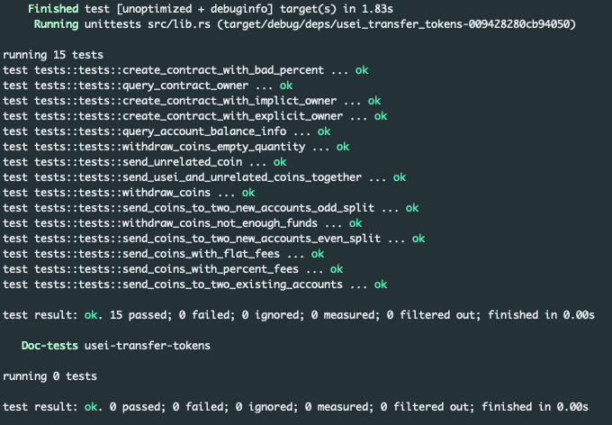

# Usei Token Transfer Contract

## Testing
To test, simply run `cargo test` (cargo version was 1.63.0 when writing)

## Requirements

- you should be able to instantiate the contract and set the owner
  - `instantiate` [here](https://github.com/redgreenblue12/usei-token-transfer/blob/46fd42edfcbf2ba75852751ca1261b0132d1248b/src/contract.rs#L23)
- you should support a read query to get the owner of the smart contract
  - `GetOwner` [here](https://github.com/redgreenblue12/usei-token-transfer/blob/46fd42edfcbf2ba75852751ca1261b0132d1248b/src/contract.rs#L222)
- you should support an execute message where an account can send coins to the contract and specify two accounts that can withdraw the coins (for simplicity, split coins evenly across the two destination accounts)
  - `SendCoins` [here](https://github.com/redgreenblue12/usei-token-transfer/blob/46fd42edfcbf2ba75852751ca1261b0132d1248b/src/contract.rs#L72)
- you should store the withdrawable coins for every account who has non-zero coins in the contract
  - Handle new account [here](https://github.com/redgreenblue12/usei-token-transfer/blob/46fd42edfcbf2ba75852751ca1261b0132d1248b/src/contract.rs#L144)
  - (I didn't remove the account key when the user withdraws all their balance since I didn't feel it was necessary from a gas perspective CMIIW, but it should be easily possible.)
- you should support an execute message where an account can withdraw some or all of its withdrawable coins
  - `WithdrawCoins` [here](https://github.com/redgreenblue12/usei-token-transfer/blob/46fd42edfcbf2ba75852751ca1261b0132d1248b/src/contract.rs#L76)
- you should support a read query to get the withdrawable coins of any specified account
  - `GetWithdrawableCoinQuantity` [here](https://github.com/redgreenblue12/usei-token-transfer/blob/46fd42edfcbf2ba75852751ca1261b0132d1248b/src/contract.rs#L224)
- you should write unit tests for all of these scenarios (we should be able to run cargo test and all of the unit tests should pass)
  - Unit tests starting [here](https://github.com/redgreenblue12/usei-token-transfer/blob/46fd42edfcbf2ba75852751ca1261b0132d1248b/src/tests.rs#L84)